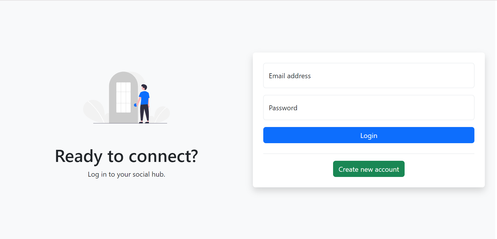
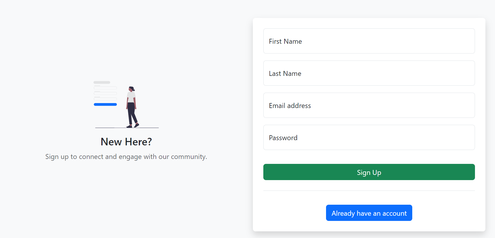
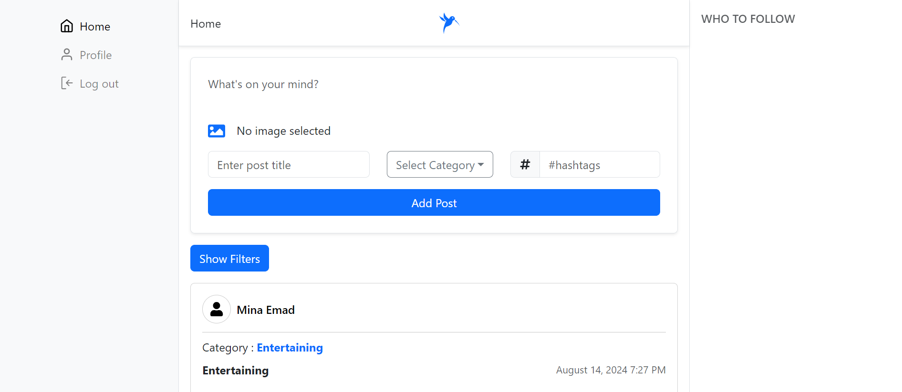
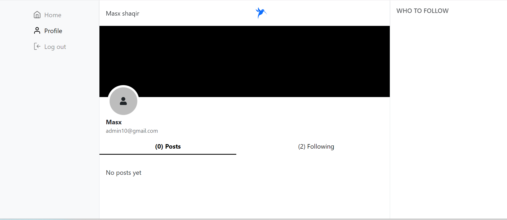
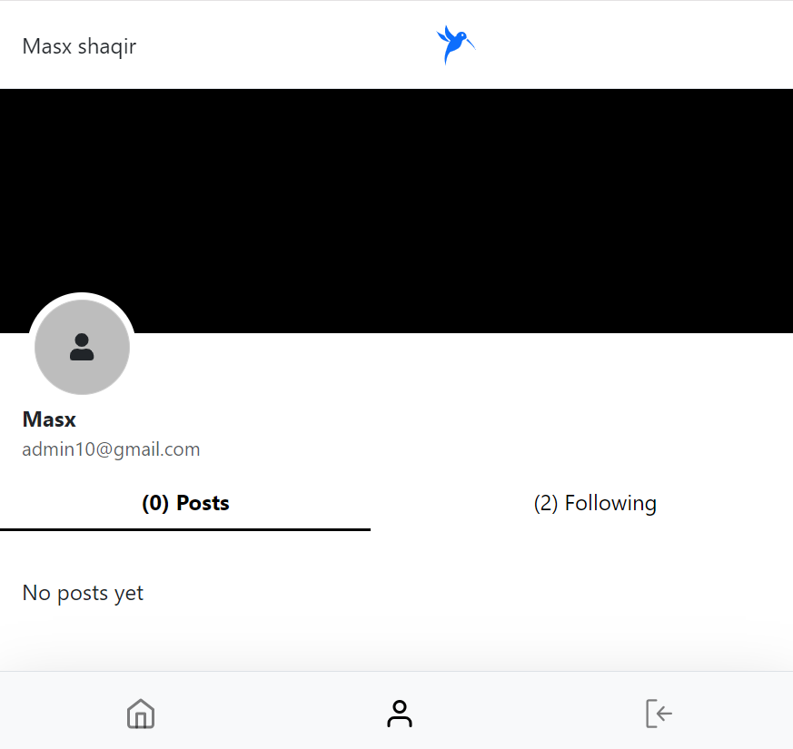
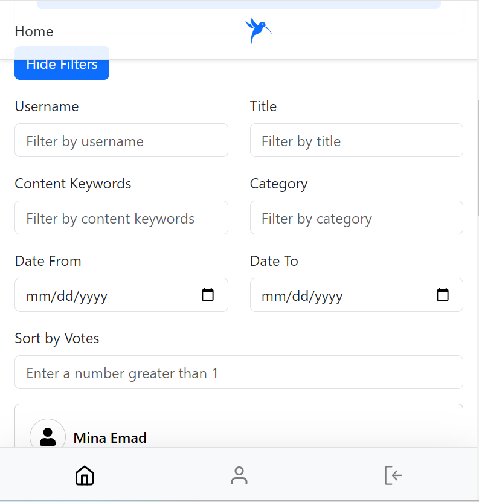
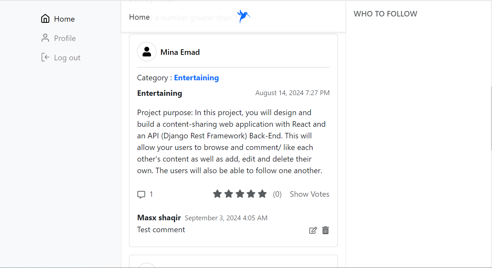
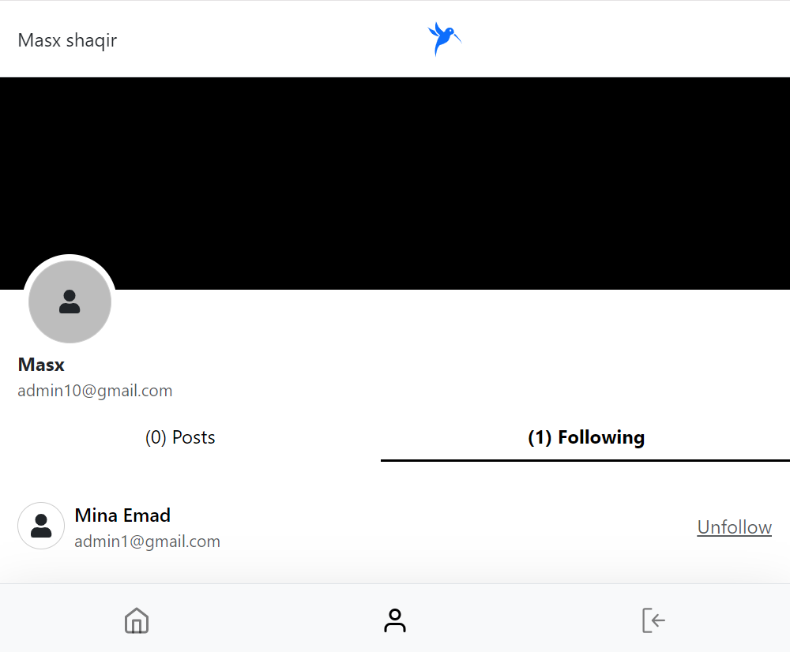

Content Sharing Web Application - Front-End
Overview
This repository contains the front-end code for the Content Sharing Web Application. Built with React.js and styled with Bootstrap, this application provides an interactive and modern user interface for users to create, browse, comment on, like, and follow content.

Features
User registration and authentication
Create, read, edit, and delete content
Comment on and vote content
Follow and unfollow other users
Search and filter content by username, popularity, date created, title, content keywords, and category
Responsive design using Bootstrap.js
Getting Started
Prerequisites
Node.js (version 14.x or higher)
npm (Node Package Manager)
Installation
Clone the Repository

bash

Copy code

git clone https://github.com/Masxshaqir/socialmediaclone.git

cd socialmediaclone

Install Dependencies

bash

Copy code

npm install

Configuration

Update the src/config.js file with your API base URL and any other required configuration settings.

Start the Development Server

bash

Copy code

npm run dev

The application will be available at http://localhost:3000 in your browser.

Project Structure
src/: Contains all source code
components/: Reusable React components
pages/: Page components
services/: API service functions
styles file as index.css file/: Custom styles and Bootstrap overrides
public/: Static files such as index.html
package.json: Project metadata and dependencies
README.md: This file

bash
Copy code
npm run build
The production build will be output to the build/ directory and can be deployed to your hosting service.

Contributing
Contributions are welcome! Please submit issues and pull requests for any enhancements or bug fixes.

