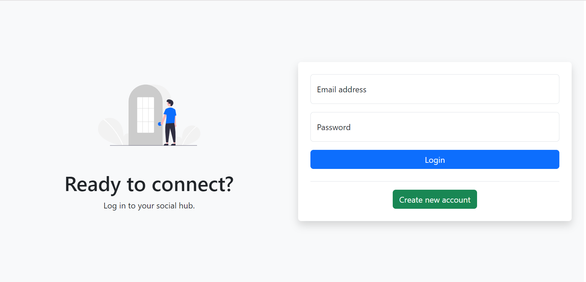
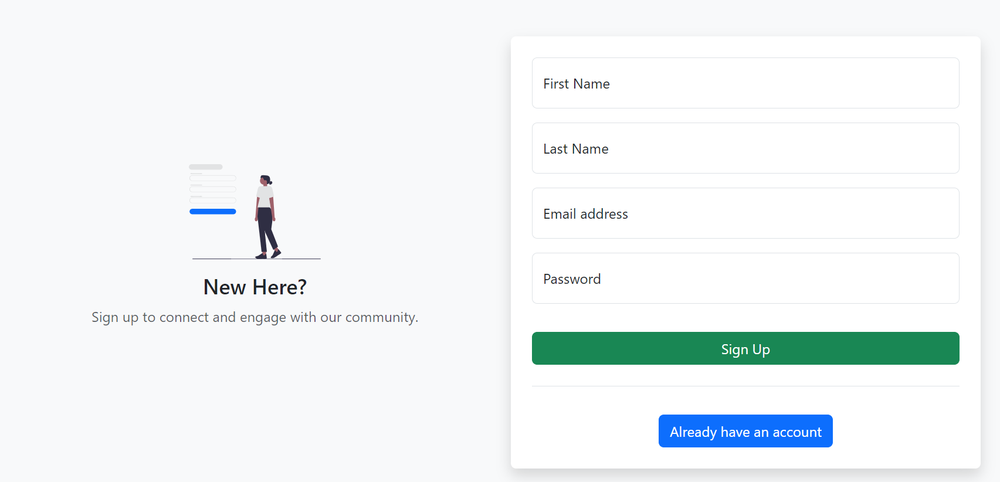
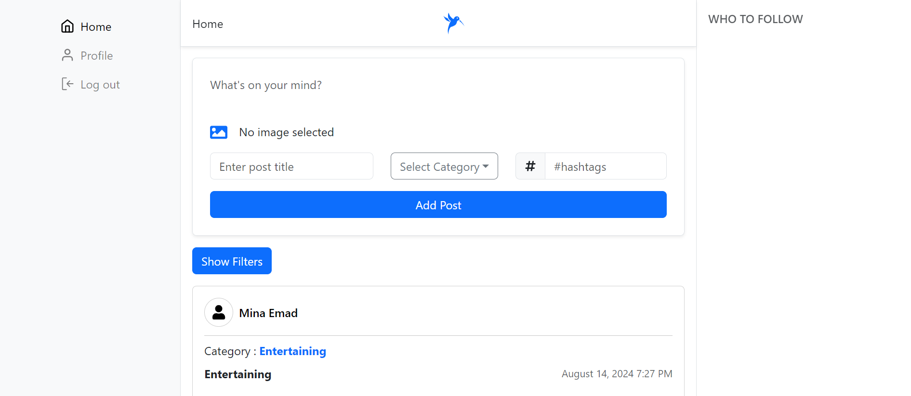
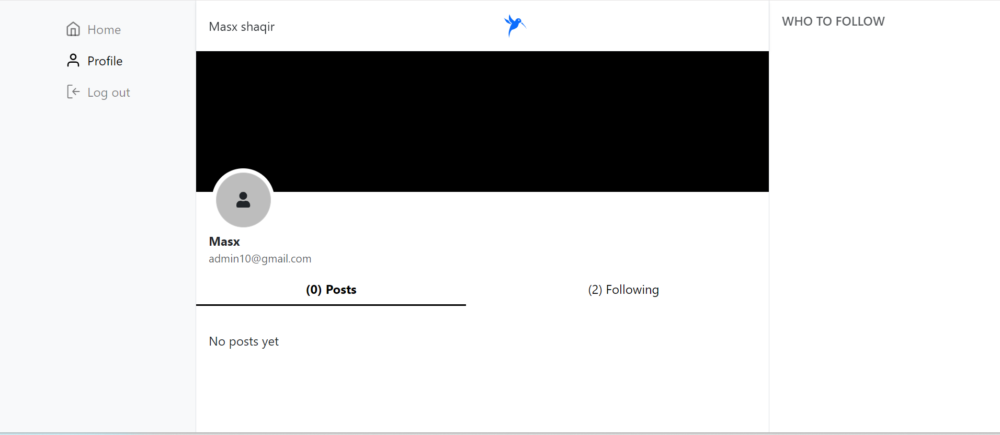
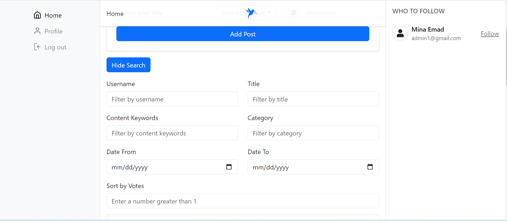
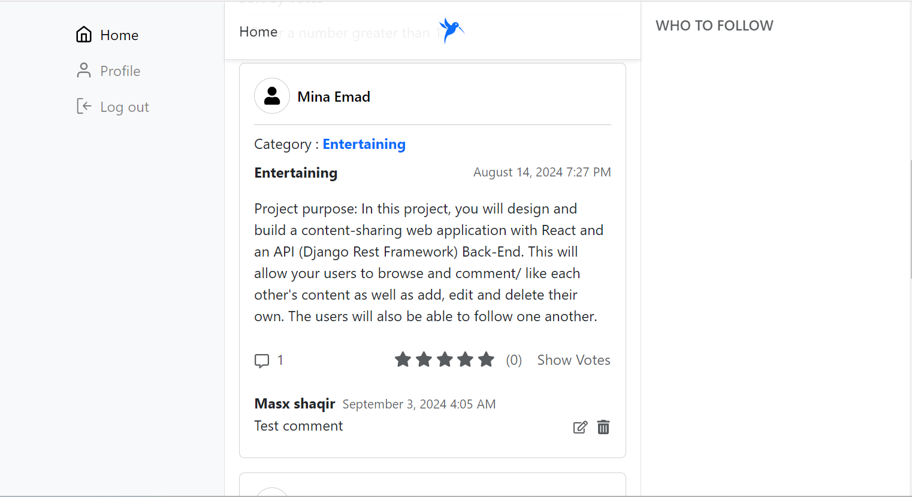
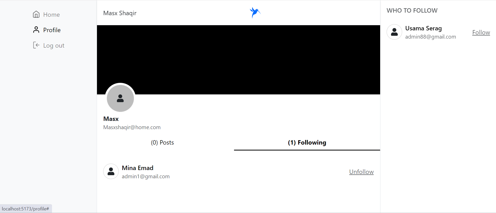
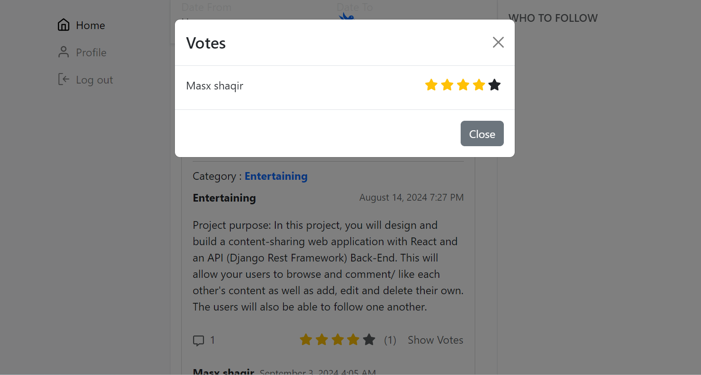
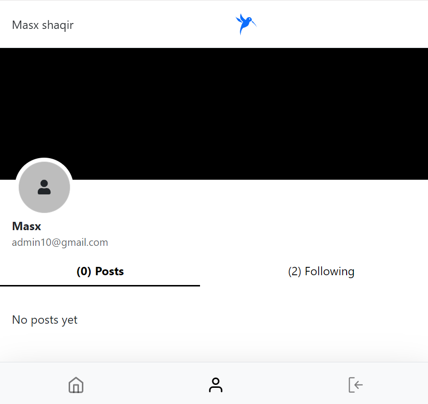

# Content Sharing Web Application - Frontend

## Overview

Welcome to the **Content Sharing Web Application**! This repository hosts the frontend code for a modern content-sharing platform, designed to provide users with an intuitive interface for creating, browsing, interacting with, and managing content. Built with **React.js** and styled with **Bootstrap**, this application offers a responsive design that works seamlessly across all devices.

# Project Goals
Here are some project goals for your content-sharing platform:

1- User Engagement and Interaction: Encourage users to actively participate by enabling post creation, voting, and commenting on content. Support user-to-user interaction through       friendships and following features.

2- Content Discovery and Search: Provide an easy way for users to discover content through hashtag filtering, post search functionality, and categorization.

3- Scalability and Extensibility: Build a scalable backend with Django Rest Framework, supporting potential migration to more robust databases like PostgreSQL or MySQL.

4- User-Centric Features: Implement profile management, allowing users to personalize their experience and manage their interactions (e.g., adding/removing friends, updating 5- profiles).

6- Secure Authentication: Ensure secure access control with token-based authentication for user registration, login, and access to resources.

7- Mobile-Ready Interface: Deliver a responsive React.js frontend to provide a smooth user experience across devices.

8- Smooth Deployment and Maintenance: Utilize Heroku for deployment, ensuring the platform can be updated and scaled efficiently.

9- Collaboration and Community Growth: Foster community engagement through contributions, allowing external developers to add features or fix issues by supporting open-source collaboration.

## The Problem my project Solve
The social media clone project provides a platform for users to connect, share, and engage with a variety of content in real-time, addressing the need for community interaction and content sharing. It is designed for individuals who seek a seamless, user-friendly way to create posts, interact through comments and votes, use hashtags, and manage friendships within an online community. This project aims to make social networking accessible to everyone, whether for sharing personal updates, networking, or exploring others' content in a dynamic and engaging way.

## Features

### User Registration and Authentication

- **User Signup**: New users can register by providing their name, email, and password. Passwords are securely hashed before storage.
- **User Login**: Registered users can log in using their email and password, receiving a secure authentication token for subsequent requests.
- **User Authentication**: The application ensures that only authenticated users can create, edit, or delete content. Session management is handled using tokens stored in local storage.

### Content Management

- **Create Content**: Authenticated users can create new posts, including text, images, and categories. A rich text editor with formatting options enhances content presentation.
- **Read Content**: Users can browse a wide variety of user-generated content. Posts are displayed in a card format, with options to interact (vote, comment).
- **Edit Content**: Content creators can easily edit their posts, with the original structure preserved for seamless updates.
- **Delete Content**: Users can delete their posts, with a confirmation prompt to prevent accidental deletions.

### Interaction Features

- **Commenting**: Users can comment on posts, with a threaded comment section that allows for replies to specific comments.
- **Voting**: Posts can be upvoted or downvoted, influencing visibility and ranking on the platform.
- **Following Users**: Users can follow others to receive updates on their latest posts. Followers and following lists are displayed on user profiles.

### Search and Filtering

- **Search by Username**: Quickly find content from specific users by searching for their username.
- **Filter by Popularity**: Sort content based on the number of likes or votes received.
- **Filter by Date Created**: View content based on creation date, from the most recent to the oldest.
- **Search by Title and Keywords**: Locate posts by searching for specific titles or keywords.
- **Filter by Category**: Narrow down content by selecting specific categories, making it easier to find relevant posts.

### Responsive Design

- **Bootstrap Integration**: The application is fully built with Bootstrap, ensuring a responsive and visually consistent design.
- **Mobile-First Approach**: The layout adapts to different screen sizes, providing an optimal viewing experience on mobile devices, tablets, and desktops.
- **Custom Bootstrap Overrides**: Custom styles are applied to enhance Bootstrap's default look and feel, aligning with the application's branding.

## Getting Started

### Prerequisites

Ensure you have the following software installed on your development machine:

- **Node.js** (version 14.x or higher): Required to run the development server and manage dependencies.
- **npm** (Node Package Manager): Comes with Node.js and is used to install dependencies.

### Installation

1. **Clone the Repository**  
   Clone this repository to your local machine:

   ```bash
   git clone https://github.com/Masxshaqir/socialmediaclone.git
   cd socialmediaclone
    ```
2. **Install Dependencies**
   ```bash
   npm install
   ```
### Configuration

Before running the application, update the configuration settings:
  1. Navigate to src/config.js.
  2. Update API_BASE_URL with your backend server URL.
  3.Add any other environment-specific configurations as needed. 
  
### Running the Development Server

To start the development server, execute:
  ```bash
  npm run dev
  ```
The application will be compiled and served locally at http://localhost:3000. Open this URL in your web browser to view the application.

### Deployment to Heroku
To deploy the application to Heroku, follow these steps:
1. **Prerequisites**
    - Ensure you have a Heroku account.
    - Ensure your project is hosted on GitHub.
2. **Steps**
   - Create a New Heroku App.
       Log in to your Heroku dashboard.
       Click on the New button in the top right corner and select Create New App.
       Provide a unique name for your app and choose a region. Click Create App.

   - Connect to GitHub Repository
       In your Heroku app dashboard, go to the Deploy tab.
       In the Deployment method section, select GitHub.
       Search for your repository by name and click Connect.

   
   - Enable Automatic Deploys (Optional)
       In the Deploy tab, you can enable Automatic Deploys from the GitHub branch of your choice. This will automatically deploy your app whenever you push changes to that branch.
       Alternatively, you can deploy manually by clicking Deploy Branch under the Manual Deploy section.
## Testing
This project includes both manual and automated testing to ensure functionality and user experience quality.

- Types of Tests
   1. Unit Tests: Verify individual components and utility functions.
   2. Integration Tests: Confirm interactions between modules, such as post creation and hashtag handling.
   3. End-to-End Tests: Simulate real user actions like login, post creation, and comment functionality.
   4. UI Tests: Ensure proper rendering and responsiveness across devices.
   5. Performance Tests: Check load times and responsiveness for critical features.

- Manual Testing
   1. Basic Functionality: Register, log in, create posts, and comment.
   2. UI Responsiveness: Test layout adaptability across screen sizes.
   3. Error Handling: Verify user-friendly error messages.
- Automated Testing
   1. Unit Tests: Run npm test to verify individual components.
   2. Integration Tests: Use npm run test:integration to check module interactions.
   3. End-to-End Tests: Run with Cypress (npx cypress open) to validate main flows.


### Screenshots

Here are some screenshots of the application to give you a better idea of its look and feel:
1. Rsponsive View:


2. Login Page:



3. Signup Page:



4. Home Page:



5. User Profile:



6. Content Filtering:



7. Comments Section:



8. Followers Page:



9. Voting Section:



10. Responsive User Profile:



